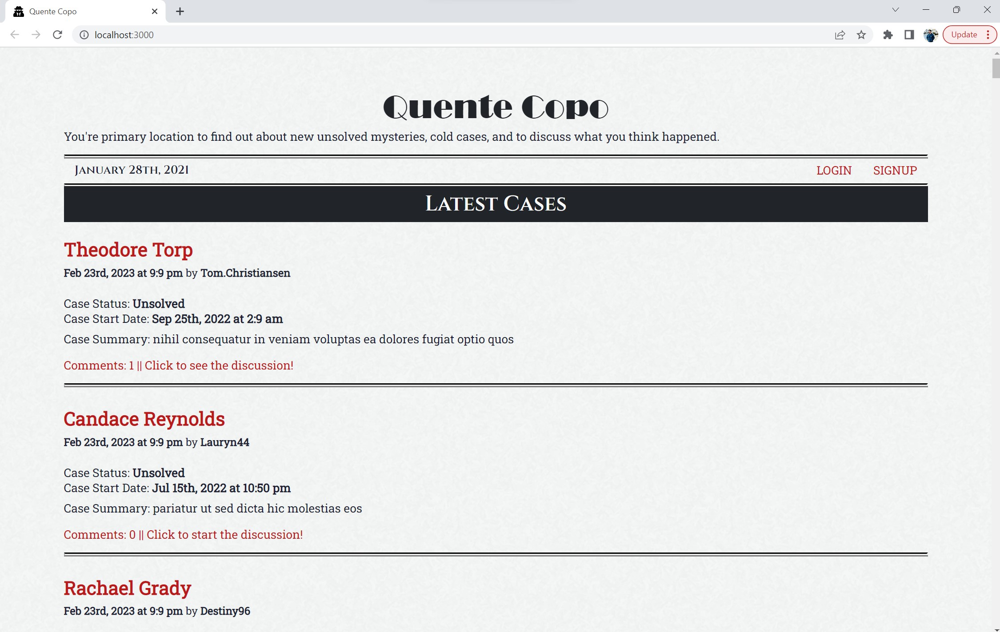

# Imrans-Book-Search-Engine

## Description

This project is a MERN Stack application. An blog-style application focused on unsolved mysteries. Users can signup for an account and login to commment on posts. 

[Link to live application](https://murmuring-wave-99733.herokuapp.com/)

## Table of Contents
* [Installation](#installation)
* [Usage](#usage)
* [License](#license)
* [Credits](#credits)
* [Questions](#questions)

## Installation

1. To install application, clone the main project via the HTTP or SSH link on github.

```
git clone
```

2. Once cloned, open the project folder in your text editor and run the following command in terminal to install all dependencies.
   Important note - You will need to run the below command in the 'root', 'client' and 'server' directory paths.

```
npm install
```

## Usage


[Link to live application](https://murmuring-wave-99733.herokuapp.com/)


 
  


## License


[MIT License](./LICENSE)


## Credits

- React
- Apollo Client
- GraphQL
- Json web token
- Jwt-decode
- MongoDB
- Mongoose
- React-bootstrap
- Bootstrap
- Express
- Node.js
- Bcrypt
- Faker
- localStorage
- JSX / JavaScript
- HTML
- CSS

## Questions

If you have any Questions :
  * Email : imran.rassi.2020@gmail.com
  * GitHub: [imran7rassi](https://github.com/imran7rassi)